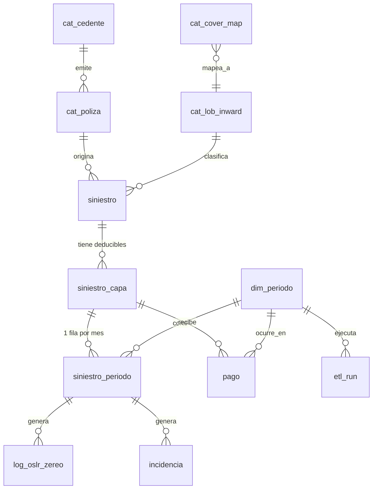

# Propuesta de Base de Datos — Transporte, Carga y Embarcaciones (Marine)
**Kot Insurance Company AG · Área Actuarial**
Documento de arquitectura — v1 (borrador de discusión), 31 de agosto de 2026

> Este documento propone cómo se vería la base de datos del proceso Marine si se
> construyera desde cero hoy, partiendo del proceso real descrito en
> `Documentacion_Proceso_Marine.docx` y de las cinco notebooks que hoy lo ejecutan.
> No es un rediseño del proceso de negocio (las reglas de OSLR, zereo, legacy,
> etc. se conservan tal cual) — es un rediseño de **dónde vive el dato y cómo se
> garantiza su integridad**, para que dejen de vivir en Excel/pickle y en un
> archivo `config_marine.py`.

---

## 1. Diagnóstico del modelo actual

El proceso genera, cada mes, una tabla ancha (`transporte` / `transportehist`) con
~40 columnas por siniestro, más una decena de archivos Excel de auditoría
(`Log_Zereo_OSLR`, `Incidencias_OSLR`, `no_cruzan`, etc.) que documentan **por qué**
el número quedó como quedó. Eso funciona, pero tiene cinco puntos frágiles que se
ven directamente en el log de la última corrida:

1. **Columnas ensanchadas por periodo** (`GROSS RESERVE 202604`) en vez de una
   columna de periodo — cada mes que pasa la tabla lógica es más ancha.
2. **Historización por bandera `activo`** con `TRUNCATE + INSERT`, en vez de una
   llave de periodo real — funciona, pero es fácil de corromper si dos corridas
   se traslapan.
3. **Tipos inferidos desde Excel/pandas cada mes** — el log muestra
   `int` vs `bigint`, `date` vs `datetime` como mismatches recurrentes entre la
   tabla histórica y la temporal. Es una fuga de tipos esperando a romper algo.
4. **Catálogos de negocio dentro de código Python** (`COVER_MAP`,
   `MAP_LOB_INWARD`, `OSLR_ZERO_MANUAL`, `list_nocross`, legacy) — cualquier
   cambio de regla de negocio requiere tocar y desplegar un `.py`.
5. **Auditoría en archivos Excel sueltos por mes** — excelente para revisar un
   mes, imposible de consultar longitudinalmente ("¿cuántas veces se ha zereado
   este siniestro en los últimos 2 años?").

La propuesta de abajo resuelve estos cinco puntos sin cambiar ni una regla de
negocio del proceso.

---

## 2. Principios de diseño

- **Normalizar el tiempo, no ensanchar columnas.** Una tabla de hechos por
  periodo (`siniestro_periodo`), no una columna por mes. Comparar mes contra
  mes se vuelve una ventana (`LAG`), no un `JOIN` contra columnas con sufijo.
- **Separar crudo → curado → consumo** (bronze/silver/gold). Lo que hoy son
  `bd_update.xlsx`, `{periodo}_Siniestros_Marine.xlsx` y `_PROCESADO.xlsx` son,
  en realidad, tres capas de la misma tubería. Cada capa debe vivir en su
  propio esquema/tablas, no en tres archivos con nombres parecidos.
- **Catálogos como tablas, no como diccionarios de Python.** `COVER_MAP`,
  `MAP_LOB_INWARD`, legacy, `OSLR_ZERO_MANUAL`, `list_nocross`,
  duplicados conocidos → tablas con historial de cambios (quién, cuándo, por
  qué). Actuaría edita una tabla, no un `.py` en git.
- **Auditoría como tabla, no como archivo del mes.** Todo lo que hoy termina en
  `Log_Zereo_OSLR.xlsx`, `Incidencias_*.xlsx`, `Validacion_*.xlsx` se inserta en
  tablas de auditoría con periodo, siniestro y regla — y se puede seguir
  exportando a Excel para revisión humana, pero ya no es la única copia.
- **Llaves y candados como constraints de SQL, no como `assert` en Python.**
  El "blindaje legacy" y el guardia de STATUS deberían ser imposibles de violar
  por diseño de esquema (constraint / trigger), no solo por disciplina del
  notebook.
- **Cargas idempotentes con `MERGE`,** no truncate+append. Poder re-correr el
  programa 5 dos veces en el mismo periodo sin duplicar ni requerir
  `limpiar_tablas_transporte()`.

---

## 3. Modelo de datos propuesto

### 3.1 Catálogos (dimensiones de negocio, mantenidas por Actuarial)

| Tabla | Reemplaza hoy | Contenido |
|---|---|---|
| `cat_cedente` | lista fija en notebooks | Inbursa, Atlas, Banorte, Mapfre, Pemex REAS… |
| `cat_lob_inward` | `MAP_LOB_INWARD` | Catálogo canónico de líneas de negocio (CASCO Y MAQ., P&I, CARGA…) |
| `cat_cover_map` | `COVER_MAP` | texto de cobertura normalizado → `lob_id`, con vigencia y autor |
| `cat_poliza` | rutas hardcodeadas en sección 3 del programa 1 | número de póliza, cedente, `es_legacy`, `es_subsidiaria`, vigencia |
| `cat_status` | valores libres `P/C/T` | catálogo cerrado con descripción |
| `cat_oslr_zero_manual` | `OSLR_ZERO_MANUAL` | siniestro, motivo, vigencia del ajuste |
| `cat_excepcion_nocross` | `list_nocross` | siniestro, motivo, fecha |
| `cat_duplicado_conocido` | lista de duplicados conocidos | criterio de conservación |
| `cat_geografia` | `Location_Clasificado.xlsx` (caché) | texto de ubicación → estado/país, método de detección, confianza |
| `cat_ciudad_municipio` | `ciudades_mexico.xlsx` / `municipios_mexico.xlsx` | catálogo geográfico base para el clasificador |

Todas con columnas de auditoría (`vigente_desde`, `vigente_hasta`, `creado_por`,
`fecha_alta`) para que un cambio de regla quede registrado igual que hoy queda
registrado un ajuste de OSLR.

### 3.2 Capa cruda / bronze (una fila por fila de origen, inmutable)

| Tabla | Reemplaza | Para qué |
|---|---|---|
| `stg_bdx_raw` | `{periodo}_BDX_Marine.xlsx` | Todo lo leído de cada BDX, con `cedente_id`, `archivo_origen`, `hoja_origen`, `fila_origen`, `batch_id`. Trazabilidad completa hasta el Excel original. |
| `stg_contable_raw` | `Payments_{periodo}.xlsx` (AE/CL/VA) | Movimientos contables crudos, mismo criterio de lineage. |

Esta capa nunca se sobreescribe: si algo se cargó mal, se corrige con una fila
de reverso, no editando la fila original. Es el equivalente a "nunca se
sobrescribe información sin dejar rastro" pero a nivel base de datos, no solo a
nivel de la carpeta `Incidencias`.

### 3.3 Núcleo del negocio (silver)

| Tabla | Grano | Reemplaza |
|---|---|---|
| `siniestro` | 1 fila por `CLAIM NUMBER` + `LoB-Inward` (= `KEY LOB`) | La identidad del siniestro, estable entre periodos |
| `siniestro_capa` | 1 fila por deducible distinto de un mismo siniestro (`KEY DED`) | El caso "multi-deducible" |
| `dim_periodo` | 1 fila por `AñoMes` | — |
| `siniestro_periodo` | 1 fila por capa × periodo | El corazón de `transporte`/`transportehist`, pero **largo**, no ancho: `gross_reserve`, `deductible`, `net_reserve_bdx`, `oslr_calculado`, `oslr_final`, `status_codigo`, `monthly_flag`, `attritional_large`, `nat_cat`, `uw_year`, etc. |
| `pago` | 1 fila por movimiento contable aplicado (`AE`/`CL`/`VA`) | Los acumulados (`CUMULATIVE CLAIMS PAID`…) se derivan con `SUM()` en vez de mantenerse como columna recalculada a mano cada mes; opcionalmente se materializan en `siniestro_periodo` por performance. |

Con esto, "¿cuál era el OSLR de este siniestro hace 6 meses?" es
`SELECT oslr_final FROM siniestro_periodo WHERE capa_id=? AND periodo_id=?`
en vez de ir a buscar la columna `OSLR 202601` en una hoja de Excel de hace
seis meses.

### 3.4 Auditoría y control (reemplaza los Excel de "Incidencias")

| Tabla | Reemplaza |
|---|---|
| `log_oslr_zereo` | `Log_Zereo_OSLR.xlsx` — regla, OSLR antes/después, periodo |
| `log_ajuste_netreserve` | `Ajustes_OSLR_vs_NetReserve.xlsx` |
| `incidencia` | `no_cruzan`, `Incidencias_fechas`, `Incidencias_OSLR`, `Incidencias_OSLR_Patron_Empirico`, `Huerfanos_COVER`, `CLAIMS_SIN_POLIZA_VIGENTE` — unificadas con una columna `tipo_incidencia`, para poder preguntar "¿cuántas incidencias de fechas hemos tenido en el año?" sin abrir 12 Excels. |
| `validacion_contable` | Las dos hojas del programa 3 (`Validación OSLR`, `Validación PAGOS`) |
| `etl_run` | El `.log` de texto del programa 5, generalizado a los 5 programas: periodo, programa, inicio/fin, registros, estado, mensaje |

Todo esto se sigue pudiendo exportar a Excel para revisión humana (una vista o
un botón "exportar este mes"), pero deja de ser el único lugar donde vive el
dato.

### 3.5 Vistas de consumo (gold — lo que hoy son las tablas `transporte`/`transportehist`)

- `vw_transporte_actual` — `siniestro` + `siniestro_capa` + `siniestro_periodo`
  filtrado al periodo activo. Reemplaza la tabla `transporte` (hoy se
  trunca y recarga cada mes); aquí es una vista, así que no hay nada que
  truncar.
- `vw_transportehist` — el mismo join sin filtro de periodo, con `activo`
  calculado (`periodo_id = periodo_activo_actual`) en vez de mantenido a mano.

Los dashboards y reportes apuntan a estas dos vistas exactamente como hoy
apuntan a las tablas — el cambio es invisible para Power BI / lo que consuma
`ikaldb`.

---

## 4. Diagrama (alto nivel)

---

## 5. Cómo quedan las reglas más delicadas del proceso

- **Blindaje legacy** — hoy es un candado en Python que congela reserva y
  deducible al final del programa 2. En el esquema nuevo, `siniestro.es_legacy`
  se combina con un `TRIGGER` (o un `CHECK` a nivel de proceso de carga) que
  **rechaza** cualquier `UPDATE`/`INSERT` a `siniestro_periodo` de una capa
  legacy que no traiga el mismo `gross_reserve`/`deductible` del periodo
  anterior y `oslr_final = 0`. Deja de depender de que nadie toque esas
  secciones del notebook.
- **Guardia de STATUS faltante** — un `CHECK (status_codigo IN (SELECT codigo
  FROM cat_status))` más `NOT NULL` hace que sea físicamente imposible
  publicar una fila sin estado válido, en vez de que el programa 4 lo detecte
  y se detenga después de haber hecho todo el trabajo.
- **Las seis reglas de "zereo"** — se mantienen como lógica de la ETL (no se
  meten a SQL como reglas mágicas), pero **cada aplicación** inserta una fila
  en `log_oslr_zereo` con `regla_codigo`, `oslr_antes`, `oslr_despues`. Eso da,
  gratis, la pregunta "¿qué regla ha zereado más dinero en los últimos 12
  meses?" — hoy solo se puede responder abriendo 12 archivos.
- **`KEY LOB` / `KEY DED` duplicados** — se vuelven las llaves naturales reales
  de `siniestro` y `siniestro_capa`, con un `UNIQUE` en SQL. Un duplicado deja
  de ser algo que el pandas detecta e imprime en pantalla, y pasa a ser algo
  que el `INSERT` rechaza antes de contaminar la tabla.

---

## 6. Qué pasa con la ETL (los 5 programas)

La lógica de negocio de los 5 programas **no cambia** — el orden, las validaciones,
las reglas de zereo, la cascada de 8 etapas del clasificador de ubicaciones,
todo se queda igual. Lo que cambia es **dónde escriben**:

| Programa | Hoy escribe | Con el nuevo esquema escribe |
|---|---|---|
| 1. Carga de Bases | `bd_update.xlsx/.pkl` | `stg_bdx_raw` + un export intermedio equivalente a `bd_update` para debug |
| 2. Actualización Contable | `{periodo}_Siniestros_Marine.xlsx` + 6 Excel de auditoría | `siniestro`, `siniestro_capa`, `siniestro_periodo`, `pago`, `log_oslr_zereo`, `log_ajuste_netreserve`, `incidencia` |
| 3. Validaciones Contables | 1 Excel con 2 hojas | `validacion_contable` |
| 4. Limpieza de Datos | `_PROCESADO.xlsx` | `UPDATE`/`MERGE` sobre `siniestro_periodo` con los campos limpios; `cat_geografia` se llena/consulta en vez de leer `Location_Clasificado.xlsx` |
| 5. Actualización de Tablas | `transporte`/`transportehist` en Azure y local | Deja de ser necesario como paso aparte — las vistas `vw_transporte_actual`/`vw_transportehist` ya reflejan lo que insertó el programa 2/4. El único trabajo que le queda es "marcar el periodo como cerrado" (`dim_periodo.es_periodo_activo`). |

Esto además **colapsa un problema real que ya existe hoy**: los mismos datos se
insertan dos veces (Azure y `SQLEXPRESS` local) desde Python, con el riesgo de
drift que ya se ve en el log (mismatches de tipo). Con un esquema real y
`MERGE` transaccional, conviene decidir cuál servidor es la fuente de verdad y
sincronizar el otro por réplica nativa de SQL Server, no por dos inserts desde
pandas.

---

## 7. Plan de migración sugerido (sin parar el cierre mensual)

1. **Fase 0 — Modelo en ambiente de prueba.** Crear el esquema nuevo en una
   base de desarrollo/staging, sin tocar producción.
2. **Fase 1 — Backfill histórico.** Migrar `transportehist` completo (los
   ~25,800 registros que ya existen) a `siniestro`/`siniestro_capa`/
   `siniestro_periodo`, validando que los totales financieros por periodo
   cuadren contra los Excel `_PROCESADO` históricos.
3. **Fase 2 — Convivencia.** El programa 5 sigue existiendo, pero en vez de
   hacer `INSERT` directo a `transporte`/`transportehist`, hace `MERGE` al
   esquema nuevo; `transporte`/`transportehist` se vuelven **vistas** sobre el
   esquema nuevo, así ningún dashboard existente se entera del cambio.
4. **Fase 3 — Mover la auditoría.** Programa 2 y 3 empiezan a insertar en
   `log_oslr_zereo`, `incidencia`, `validacion_contable` además de (o en vez
   de) generar los Excel — se puede mantener el export a Excel como
   conveniencia, generado *desde* la tabla, no al revés.
5. **Fase 4 — Catálogos fuera de Python.** `config_marine.py` deja de ser la
   fuente de verdad de `COVER_MAP`/`MAP_LOB_INWARD`/legacy/`OSLR_ZERO_MANUAL`;
   los programas los leen de las tablas `cat_*`. Un cambio de regla de negocio
   ya no requiere tocar código.
6. **Fase 5 — Limpieza.** Retirar `limpiar_tablas_transporte()`, decidir el
   rol del servidor local (réplica documentada vs. retirarlo), y sacar la
   credencial de Azure del notebook (variable de entorno o Key Vault) — ya
   señalado como pendiente en la documentación actual.

---

## 8. Lo que esto no cambia

- No cambia ninguna fórmula (`OSLR = max(max(GR-DED,0) - CumClaimsPaid, 0)`,
  las seis reglas de zereo, la cascada de ubicación en 8 etapas).
- No cambia el checklist mensual ni el orden de los 5 programas.
- No obliga a reescribir todo de golpe: cada fase deja el proceso funcionando
  y publicando en las mismas tablas/vistas que hoy consumen los reportes.

---

*Documento generado a partir de `Documentacion_Proceso_Marine.docx/.html` y del
log de ejecución `etl_transporte_202607_20260820_141234.log` de esta carpeta.
Es un punto de partida para discusión, no un DDL final — antes de crear tablas
en producción conviene validar los nombres de columnas exactos contra el
esquema SQL actual de `transportehist` (Azure `ikaldb` y `SQLEXPRESS` local).*
